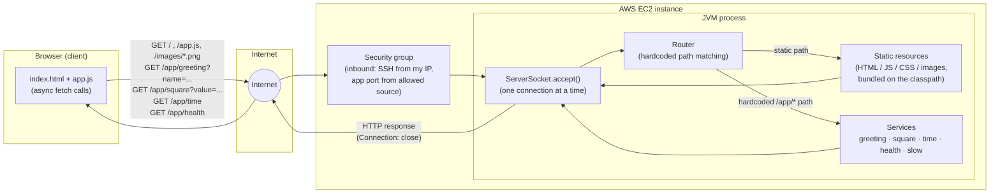

# Lab05 — From a Minimal HTTP Server to a Web Application on AWS

A small, deliberately **sequential** web application built directly on top
of `java.net.ServerSocket`: no HTTP framework, no thread pool, one
connection handled at a time. It serves static HTML/JS/images and answers
four hardcoded JSON services, and it is meant to be run both on a
developer machine and on a single AWS EC2 instance.

The point of the exercise is not to build a fast server — it is to see,
with your own eyes, what "one server, many browsers" actually looks like
before any concurrency or distribution is introduced.

## Table of contents

- [System metaphor and architecture](#system-metaphor-and-architecture)
- [Design decisions](#design-decisions)
- [Project structure](#project-structure)
- [Prerequisites](#prerequisites)
- [Installation and build](#installation-and-build)
- [How to run locally](#how-to-run-locally)
- [How to use the application](#how-to-use-the-application)
- [How to run the tests](#how-to-run-the-tests)
- [AWS deployment](#aws-deployment)
- [Evidence and results](#evidence-and-results)
- [Mandatory AWS cleanup](#mandatory-aws-cleanup)
- [Known limitations](#known-limitations)
- [Discussion questions](#discussion-questions)
- [Author and acknowledgment](#author-and-acknowledgment)

## System metaphor and architecture

**System metaphor: a single-window ticket counter.**
Picture one clerk at one counter. A visitor walks up, hands over one
request slip, the clerk reads it, does exactly one of a short list of
things they know how to do (hand over a printed page, hand over a photo,
do a small calculation, or read the clock), hands back an answer, and only
then calls "next". Nobody is served in parallel; if the clerk is busy
looking something up, everyone else waits in line — no matter how quickly
those people wave their own slips around. That is precisely this server:
`ServerSocket.accept()` is "next", the request line is the slip, the four
`/app/*` endpoints are the clerk's short list of known tasks, and the
public-resources folder is the drawer of pre-printed pages and photos the
clerk can hand out unchanged.

The **browser tab**, by contrast, is not the clerk — it is the visitor,
and a visitor can do other things (scroll, type, watch a spinner) while
waiting for the counter. That is what the asynchronous `fetch` calls in
[`app.js`](src/main/resources/public/app.js) model: the *client* stays
responsive, which is a completely different property from the *server*
being concurrent.



Component responsibilities:

| Component | Responsibility |
|---|---|
| `index.html` / `app.js` / `styles.css` | The visitor: builds the UI, fires asynchronous requests, renders success/error/loading states, never triggers a full page reload for a service call. |
| `HttpServer` | The counter itself: owns the accept loop, reads exactly one request per connection, writes exactly one response, then closes the socket. |
| `Router` | The clerk's mental checklist: explicit `if`/`switch` matching on exact paths — no generic dispatch table, no reflection. |
| `SafePath` | The rule "never hand out anything outside the drawer": normalizes and rejects any path that would resolve above `public/`. |
| `ContentTypes` | Tells the browser how to interpret what it's handed back (render HTML, run JS, decode an image). |
| `services/*` | The four (five, counting the demo-only slow endpoint) hardcoded tasks the clerk knows how to do. |
| EC2 instance + security group | Changes *where* the counter physically sits and *who is allowed to walk up to it* — not how the counter behaves. |

## Design decisions

- **Why the server stays sequential.** This lab's explicit purpose is to
  observe the baseline before introducing concurrency. Adding a thread
  pool here would hide exactly the behavior the lab asks you to measure
  (see [`SlowService`](src/main/java/edu/escuelaing/arsw/httpserver/services/SlowService.java)
  and the demo button in the UI). `HttpServer` accepts, fully handles, and
  closes one `Socket` before calling `accept()` again — nothing runs
  concurrently.
- **Why the routes are hardcoded.** `Router.route(...)` is a `switch` over
  four literal paths, falling through to static-file serving otherwise. A
  reflection-based or annotation-driven router would generalize the
  mechanism this lab wants visible: that a URL string is the *entire*
  contract between client and dispatch logic.
- **How content types are selected.** `ContentTypes.forPath` maps a file
  extension to a MIME type (`.html`→`text/html`, `.js`→
  `application/javascript`, `.png`→`image/png`, `.jpg/.jpeg`→
  `image/jpeg`, unknown→`application/octet-stream`). Every resource,
  static or generated, is sent as a `byte[]` and `Content-Length` is the
  actual byte count — this is what lets an HTML page and a PNG travel
  through the exact same response-writing code path without corruption.
- **How unsafe paths are rejected.** `SafePath.resolve` URL-decodes the
  request path, then walks it segment by segment on a stack: a `..`
  segment pops the stack, and if the stack is already empty the request is
  refused outright (`null`). This defeats both literal (`/../secret`) and
  percent-encoded (`/%2e%2e/secret`) traversal without ever touching the
  real filesystem — resources are read straight from the classpath.
- **Why the browser client is asynchronous.** The four services are
  meant to update one region of an otherwise-static page. Using `fetch`
  with `event.preventDefault()` on form submission keeps the tab
  interactive, lets a loading state be shown, and — critically for section
  6.2 of the lab — makes the *server's* sequential behavior observable:
  the client can be perfectly responsive while a second browser tab still
  visibly waits behind a slow request on the same server.
- **`Connection: close` on every response.** Because the server never
  reuses a connection, every response advertises that explicitly so
  browsers don't attempt HTTP keep-alive against a socket about to close.

## Project structure

```
.
├── pom.xml                                   # Maven build descriptor
├── deploy/
│   └── lab05-http-server.service             # sample systemd unit for EC2
├── src/
│   ├── main/
│   │   ├── java/edu/escuelaing/arsw/httpserver/
│   │   │   ├── HttpServer.java                # accept loop, request/response I/O
│   │   │   ├── Router.java                    # hardcoded path -> behavior
│   │   │   ├── SafePath.java                  # path normalization / traversal guard
│   │   │   ├── ContentTypes.java               # extension -> MIME type
│   │   │   ├── QueryParams.java                # query-string decoding
│   │   │   ├── JsonSupport.java                # JSON string escaping
│   │   │   ├── HttpResult.java                 # status + content type + bytes
│   │   │   └── services/
│   │   │       ├── GreetingService.java
│   │   │       ├── SquareService.java
│   │   │       ├── TimeService.java
│   │   │       ├── HealthService.java
│   │   │       └── SlowService.java            # demo-only, see section 6.2
│   │   └── resources/public/                   # everything the browser can fetch
│   │       ├── index.html
│   │       ├── app.js
│   │       ├── styles.css
│   │       └── images/
│   │           ├── banner.png
│   │           └── photo.jpg
│   └── test/java/edu/escuelaing/arsw/httpserver/
│       ├── RouterTest.java                     # functional matrix, no sockets needed
│       ├── SafePathTest.java
│       ├── ContentTypesTest.java
│       ├── JsonSupportTest.java
│       └── QueryParamsTest.java
└── README.md
```

Application code, tests, and public resources are kept in Maven's
conventional locations (`src/main/java`, `src/test/java`,
`src/main/resources`) so the routing/service logic (`Router` and friends)
is unit-testable in isolation from real sockets, while `HttpServer` itself
stays a thin adapter around `ServerSocket`.

## Prerequisites

- **Java 17** or newer (the build targets `--release 17`; developed and
  verified with Java 21 and run against packaged jars on Java 21).
- **Maven 3.9+**.
- A browser with developer tools, for inspecting requests.
- `curl` (or equivalent), useful for the error-path checks in the test
  matrix below.

## Installation and build

```bash
git clone <your-repository-url>
cd LAB05_TDSE-From-a-Minimal-HTTP-Server-to-a-Web-Application-on-AWS

# Download dependencies, compile, run tests, package the jar:
mvn clean package
```

This produces `target/lab05-http-server.jar`, a runnable jar with the
public resources bundled on its classpath — a single artifact, nothing
else to copy alongside it.

## How to run locally

```bash
# Default port is 35000:
java -jar target/lab05-http-server.jar

# Or choose a port explicitly (env var, system property, or CLI arg — first one wins):
SERVER_PORT=8080 java -jar target/lab05-http-server.jar
java -Dserver.port=8080 -jar target/lab05-http-server.jar
java -jar target/lab05-http-server.jar 8080
```

Then open **http://localhost:35000/** (or whatever port you chose) in a
browser. `ServerSocket` binds to all network interfaces by default, so the
same command also accepts connections from other machines once the port
is reachable (this is exactly what EC2 deployment relies on).

To stop the server: `Ctrl+C` in the terminal running it (locally), or
`sudo systemctl stop lab05-http-server` once it's deployed as a service on
EC2 (see below).

## How to use the application

The home page has four interactive sections, all backed by the four
hardcoded services:

| Action | Request | Success | Invalid input |
|---|---|---|---|
| Type a name, click **Greet me** | `GET /app/greeting?name=<name>` | `{"message":"Hello, <name>!"}` | empty name → HTTP 400 with `{"error":"..."}`, shown in the error area |
| Type a number, click **Compute square** | `GET /app/square?value=<n>` | `{"input":<n>,"square":<n²>}` | non-numeric value → HTTP 400 |
| Click **Get server time** | `GET /app/time` | `{"serverTime":"<ISO-8601>"}` | — |
| Click **Trigger 5s slow request** | `GET /app/slow` | `{"message":"Finished after 5000ms."}` after ~5s | — (demo-only, see below) |

Every action uses `fetch` and `event.preventDefault()`, so the page never
reloads: only the *Result* panel updates, a *Loading…* indicator shows
while a request is in flight, and network failures are reported
separately from HTTP error responses (a 400 is parsed as JSON and shown
as a friendly message; a dropped connection is reported as a network
error).

**Observing the sequential limitation (lab section 6.2):** open the page
in two browser windows side by side, click **Trigger 5s slow request** in
the first window, then immediately click any button in the second. The
second window's request visibly waits — its loading indicator stays up
until the first request's 5 seconds are over — even though both tabs
themselves stay perfectly responsive to scrolling/typing the whole time.
That's the difference this lab is about: an asynchronous **client** vs. a
concurrent **server**.

## How to run the tests

```bash
mvn test
```

Automated tests (JUnit 5) exercise the routing/service logic directly —
no sockets involved — covering:

- Static resource lookup, including the `/` → `index.html` default.
- Missing resource → 404, unsupported method → 405, malformed/traversal
  path → 400 (`RouterTest`, `SafePathTest`).
- Content-type selection for `.html`, `.js`, `.png`, `.jpg`
  (`ContentTypesTest`).
- Query-string decoding, including URL-encoded values (`QueryParamsTest`).
- JSON string escaping of untrusted input, including a JSON-injection
  attempt (`JsonSupportTest`).
- All four services' happy paths and validation errors (`RouterTest`).

Manual validation (protocol-level, requires the running jar):

```bash
java -jar target/lab05-http-server.jar &

curl -i http://localhost:35000/                              # 200, text/html
curl -i http://localhost:35000/app.js                        # 200, application/javascript
curl -i http://localhost:35000/images/banner.png             # 200, image/png
curl -i "http://localhost:35000/app/greeting?name=Ada"       # 200, JSON
curl -i http://localhost:35000/app/greeting                  # 400, missing name
curl -i "http://localhost:35000/app/square?value=notanumber" # 400
curl -i http://localhost:35000/does-not-exist.html           # 404
curl -i -X POST http://localhost:35000/                      # 405
curl -i "http://localhost:35000/%2e%2e/%2e%2e/etc/passwd"    # rejected, no file disclosed
for i in $(seq 1 10); do curl -s -o /dev/null -w "%{http_code}\n" http://localhost:35000/app/health; done
```

Use the browser's Network tab to confirm each static resource and JSON
service returns the expected status and `Content-Type`.

## AWS deployment

This section describes the *procedure*; no host, key, or credential is
recorded here.

1. **Package**: `mvn clean package` produces `target/lab05-http-server.jar`
   (the only artifact you transfer — static resources are inside it).
2. **Launch/reuse an EC2 instance** (course-approved Linux AMI, smallest
   approved instance type, default VPC/public subnet) via the AWS
   Academy/EC2 console.
3. **Security group**: allow inbound SSH (or your approved connection
   method) only from your current IP, and one custom TCP rule for the
   application port (e.g. 8080) from the range your instructor allows.
4. **Connect** using the approved method (Session Manager, EC2 Instance
   Connect, or SSH).
5. **Install a Java 17+ runtime**, e.g. on Amazon Linux:
   `sudo dnf install -y java-17-amazon-corretto` (or `java-21-amazon-corretto`).
6. **Transfer** `lab05-http-server.jar` to the instance (`scp`, EC2
   Instance Connect file upload, or equivalent) into e.g. `/opt/lab05/`.
7. **Run it as a managed service** so it survives logout: copy
   [`deploy/lab05-http-server.service`](deploy/lab05-http-server.service)
   to `/etc/systemd/system/`, adjust the paths/user/port for the instance,
   then:
   ```bash
   sudo systemctl daemon-reload
   sudo systemctl enable --now lab05-http-server
   sudo systemctl status lab05-http-server
   journalctl -u lab05-http-server -f
   ```
8. **Verify locally on the instance first**:
   `curl -i http://localhost:8080/app/health`.
9. **Verify remotely** by opening
   `http://<instance-public-address>:<port>/` in a browser and repeating
   the functional test matrix above against the public address.
10. **Stop cleanly** with `sudo systemctl stop lab05-http-server` when
    done testing.

## Evidence and results

Screenshots below were captured against the deployed EC2 instance
(`docs/evidence/`); the instance's public IP shown in some of them is no
longer valid once the [mandatory cleanup](#mandatory-aws-cleanup) below
is performed.

**Remote deployment — home page served from the EC2 public address**


**Protocol evidence — static resources and JSON services (`curl -i`)**

| Case | Expected | Screenshot |
|---|---|---|
| `GET /` | 200, `text/html; charset=UTF-8` |  |
| `GET /app/greeting?name=Ada` | 200, JSON `{"message":"Hello, Ada!"}` |  |
| `GET /app/square?value=7` | 200, JSON `{"input":7,"square":49}` |  |
| `GET /app/square?value=notanumber` | 400, `{"error":"'value' must be a number."}` |  |
| `GET /nope.html` | 404 Not Found |  |
| `POST /` | 405 Method Not Allowed |  |

**Section 6.2 — observing the sequential limitation**

While `/app/slow` was in flight in one browser window, another action on
the page shows the *Loading…* state until that request finishes — the
server has not moved on to it yet:


> To add these images: create a `docs/evidence/` folder at the repository
> root and save each screenshot under the exact filename referenced
> above — GitHub will then render them inline automatically. For a
> stronger section 6.2 proof, also capture two browser windows
> side-by-side (or the DevTools Network timeline) showing the second
> window's request waiting behind the slow one.

## Mandatory AWS cleanup

Do this only after every screenshot and evidence item above has been
captured — it is irreversible. A forgotten running instance keeps
generating charges even when nobody is using it.

1. **Stop the application** (optional — terminating the instance stops it
   too, but this leaves logs readable first): `sudo systemctl stop lab05-http-server`.
2. **Terminate the EC2 instance**: EC2 console → Instances → select it →
   Instance state → **Terminate instance** → confirm, and wait for its
   state to become `terminated`.
3. **Release any Elastic IP** you allocated for this lab (EC2 → Elastic
   IPs → select it → Actions → Release), if you created one — an
   unattached Elastic IP can itself incur charges.
4. **Delete the lab's security group** once no instance references it
   anymore (EC2 → Security Groups → select it → Delete).
5. **Check the Billing/Cost dashboard** on the student account to confirm
   no resources from this lab are still generating cost.

## Known limitations

- The server handles **one TCP connection at a time**; it is not
  concurrent and has no thread pool, queue, or load balancing.
- Only **`GET`** is implemented; any other method returns 405.
- Routing recognizes exactly **four real services** (`greeting`, `square`,
  `time`, `health`) plus one demo-only `slow` endpoint — there is no
  general-purpose router.
- No persistence, authentication, TLS, or production hardening of any
  kind. This is a teaching baseline, not a production HTTP server.

## Discussion questions

Short answers, expanded upon during the lab demonstration:

1. **Why does a single HTML page cause several HTTP requests?** The
   initial HTML response only describes the page; the browser then issues
   separate requests for every `<script>`, ``, and `<link>` it finds
   while parsing that HTML.
2. **Why must image responses be treated as bytes rather than text?**
   Binary image formats are not valid character-encoded text; decoding and
   re-encoding them through a text charset would corrupt the bytes. Every
   resource here is read and written as `byte[]` for exactly this reason.
3. **What is the role of the response content type?** It tells the
   browser how to interpret the body — render markup, execute a script, or
   decode pixel data — independent of the requested URL's spelling.
4. **What is hardcoded in this design, and what would a routing
   framework eventually generalize?** The exact set of `/app/*` paths and
   their handlers is hardcoded in `Router`. A framework would generalize
   path-to-handler *registration* (annotations, path templates, method
   dispatch tables) — the mechanism this lab intentionally keeps visible.
5. **Why can the browser remain responsive while the server still
   handles requests sequentially?** Because responsiveness is a property
   of the *client's* event loop (`fetch` doesn't block the tab), while
   sequential handling is a property of the *server's* accept loop — they
   are independent axes, demonstrated directly in section 6.2.
6. **What changed when the server moved to EC2? What did not change?**
   The network location, reachable address, and the operating system
   changed. The application code, its sequential behavior, and its
   single-connection capacity limit did not.
7. **What happens when two users send slow requests at almost the same
   time?** The second request is queued at the TCP/accept level and its
   response does not begin until the first connection is fully handled
   and closed — observable directly with the `/app/slow` demo endpoint.
8. **What is the next architectural limitation you would address, and
   why should concurrency come before load balancing?** Concurrency
   (serving more than one connection at once, e.g. a thread pool) is a
   single-instance improvement; load balancing only pays off once a
   single instance can already use its own resources efficiently —
   distributing load across instances that are each artificially
   bottlenecked to one request at a time would just move the same
   bottleneck around instead of removing it.

## Author and acknowledgment

Author: Joshua (student, TDSE course).

Part of the starting-point content and code referenced by this lab
(sections on `ServerSocket`/`Socket`, and the initial single-request
`HttpServer` example) is based on the Java networking tutorials at
[docs.oracle.com/javase/tutorial/networking](https://docs.oracle.com/javase/tutorial/networking/),
as provided by the course material for this workshop.


pruebas curl y 6.2:

1. 

2. 

3. 

4. 

5. 

6. 

7. 


pagina funcional y verificacion local:


paso 7 servicio corriendo


jar paso correctamente a la maquina virtual con la llave nueva creada


